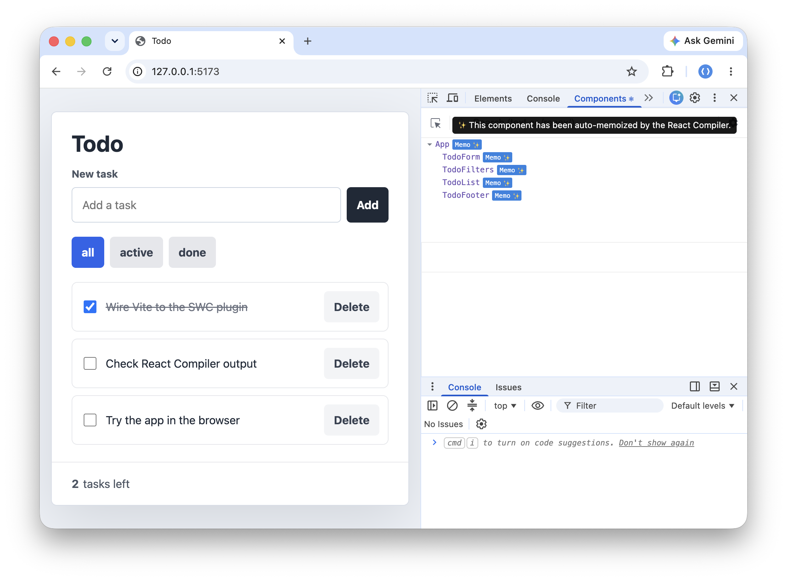

# swc-plugin-react-compiler

SWC plugin that runs the Rust port of React Compiler through SWC.



> [!NOTE]
> This is an unofficial plugin built to use the Rust port of React Compiler with SWC before an official SWC integration is available.

## Install

Install the plugin with the package manager your app already uses.

```sh
npm install -D swc-plugin-react-compiler
```

```sh
pnpm add -D swc-plugin-react-compiler
```

```sh
yarn add -D swc-plugin-react-compiler
```

## Vite Usage

The package exports the absolute path to the compiled Wasm plugin. Pass that path to `@vitejs/plugin-react-swc`.

```ts
// vite.config.ts
import react from '@vitejs/plugin-react-swc';
import { defineConfig } from 'vite';
import reactCompilerPlugin from 'swc-plugin-react-compiler';

export default defineConfig({
  plugins: [
    react({
      plugins: [[reactCompilerPlugin, { compilationMode: 'all' }]],
    }),
  ],
});
```

The options object is forwarded to the React Compiler plugin options. For quick experiments, `compilationMode: 'all'` makes the transform easier to verify.

## SWC Usage

You can also pass the exported Wasm path directly to `@swc/core`.

```ts
import { transform } from '@swc/core';
import reactCompilerPlugin from 'swc-plugin-react-compiler';

const result = await transform(source, {
  filename: 'Component.tsx',
  jsc: {
    parser: {
      syntax: 'typescript',
      tsx: true,
    },
    target: 'es2022',
    experimental: {
      plugins: [[reactCompilerPlugin, { compilationMode: 'all' }]],
    },
  },
});

console.log(result.code);
```

## Development

This repository uses `mise`.

Install the configured tools:

```sh
mise install
```

Set up the workspace:

```sh
mise exec -- just setup
```

Build the plugin:

```sh
npm run build
```

Run tests:

```sh
npm run test
```

Run all checks:

```sh
npm run check
```

Run the Vite example in development mode:

```sh
mise exec -- just example-dev
```

The dev server serves the TODO example at `http://127.0.0.1:5173/`.

## Task Reference

The `justfile` defines the main development tasks:

```sh
just build        # Build the Wasm plugin and copy it to the package root
just check        # cargo check, typecheck, oxlint, and oxfmt
just test         # Rust tests
just example      # Build the Vite TODO example
just example-dev  # Run the Vite TODO example locally
just format       # Apply oxfmt
```

## License

[MIT](./LICENSE)
